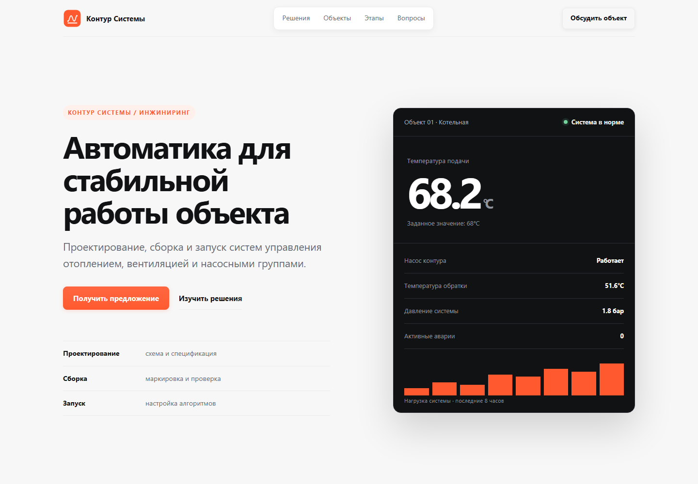

# Контур Системы — лендинг инженерной автоматизации

Учебный портфолио-проект одностраничного сайта для компании, которая проектирует и запускает автоматику отопления, вентиляции и насосных групп.

Проект создан по мотивам реального объявления FL.ru от 23.09.2026, но не является работой для автора объявления. Название компании, дизайн и тексты разработаны специально для демонстрации навыков. Реальные контакты, отзывы, сертификаты и коммерческие сведения не используются.



## Что показывает проект

- строгий адаптивный B2B-дизайн;
- продающую структуру без неподтверждённых обещаний;
- интерфейсную панель с подписанными техническими показателями;
- контекстный фотоблок со шкафом управления, пусконаладкой и инженерным контуром;
- понятное описание услуг, объектов, этапов и результата работ;
- доступную навигацию и нативную проверку формы;
- мобильную версию без разрыва слов в заголовках.

## Структура страницы

1. Первый экран с результатом для клиента, CTA и панелью системы.
2. Направления автоматизации.
3. Типовые объекты и демонстрационные сценарии.
4. Четыре этапа работы.
5. Состав передаваемого результата.
6. Частые вопросы.
7. Запрос предварительного расчёта.

## Технологии

- семантический HTML5;
- CSS3: Grid, Flexbox, `clamp()` и адаптивные медиазапросы;
- Vanilla JavaScript;
- системный стек шрифтов без внешних зависимостей;
- локальная SVG-иконка сайта.

Сборщик, фреймворки и внешние библиотеки не требуются.

## Локальный запуск

Можно открыть `index.html` напрямую или запустить статический сервер из папки проекта:

```powershell
python -m http.server 8003
```

После этого открыть `http://127.0.0.1:8003/`.

## Форма

Форма является учебной. Браузер проверяет обязательные поля, после чего JavaScript показывает сообщение об успешной демонстрационной проверке. Введённые данные не сохраняются и не отправляются.

Для реального проекта потребуется отдельный серверный обработчик, защита от спама, подтверждённый канал получения заявок, политика обработки персональных данных и согласованный текст согласия.

## Социальное доказательство

В проекте намеренно нет вымышленных отзывов, клиентов, сертификатов и результатов. Демонстрационные показатели интерфейса показывают способ подачи технических данных, но не являются реальным кейсом. В коммерческой версии этот участок нужно заменить подтверждённым кейсом, отзывом или измеримым результатом заказчика.

Три тематических изображения созданы специально для этого учебного проекта и хранятся локально. Они показывают типовые инженерные процессы, но не являются фотографиями выполненных компанией объектов. Их назначение и происхождение указаны в `image-sources.md`.

## Доступность и проверка

- связанные `label` для полей формы;
- видимый клавиатурный фокус;
- ссылка для перехода к основному содержанию;
- минимальная высота основных элементов управления 44–48 px;
- поддержка `prefers-reduced-motion`;
- проверка внутренних ссылок и обязательных полей;
- адаптация для широкого экрана, планшета и смартфона.

## Файлы проекта

- `index.html` — основная страница;
- `styles.css` — дизайн и адаптивность;
- `script.js` — демонстрационное поведение формы;
- `favicon.svg` — локальная иконка;
- `hero-concepts.html` и `hero-concepts.css` — сохранённые варианты первого экрана;
- `project-brief.md` — границы учебной задачи;
- `PROJECT_STATUS.md` — состояние и дальнейший план;
- `image-sources.md` — сведения о визуальных ресурсах.

## Перед коммерческим использованием

Нужно заменить учебное название и тексты подтверждёнными данными заказчика, добавить реальные контакты, услуги, цены, кейсы или отзывы, документы и серверную отправку формы. После выбора домена также нужно заполнить абсолютные `og:url` и `og:image` для корректного предпросмотра ссылок.

